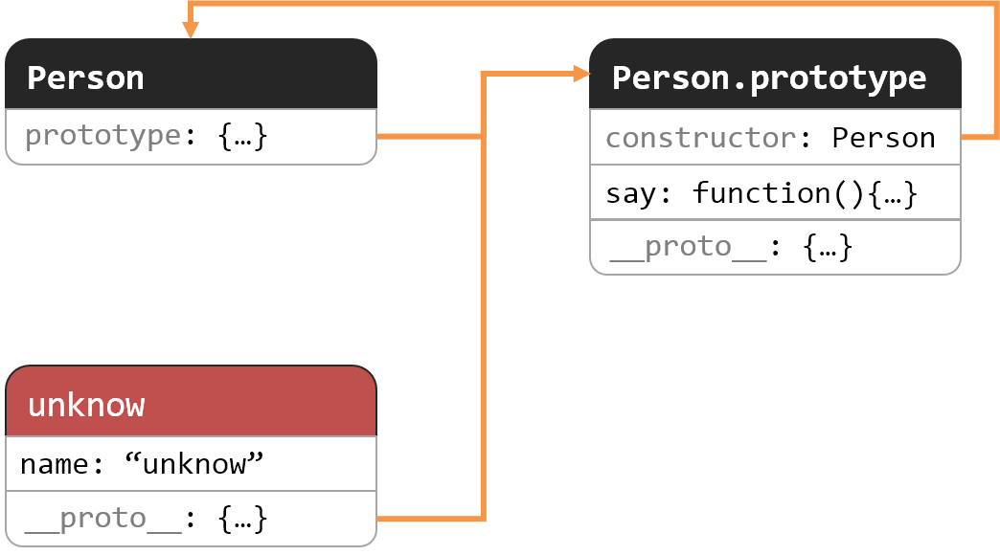
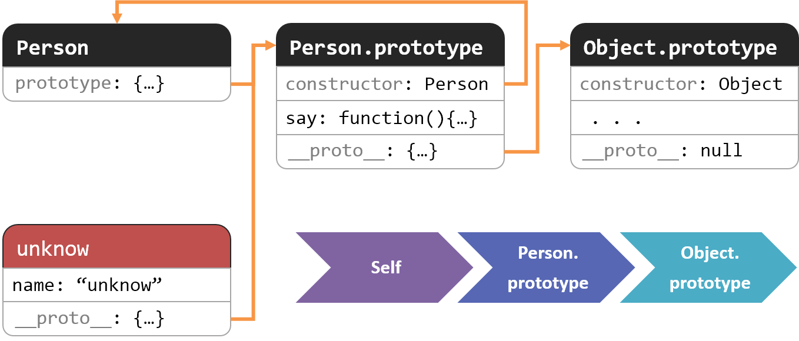

# Chapter 2. Prototype Chain

## 原型

JS的原型机制简单来说：

1. 所有的函数都（除了`.bind()`返回）具有`prototype`属性，指向其原型对象。
2. 所有的对象均具有内部`[[Prototype]]`属性；可以通过浏览器实现的`__proto__`访问器属性来获取。
3. 当前对象查询不到的属性，会向`[[Prototype]]`属性指向的原型对象中查找。

最简单的栗子：

```javascript
function Person(name) {
    this.name = name;
}

Person.prototype.say = function () {
    console.log(`Hello, It's ${this.name}`);
};

var unknow = new Person('unknow');
unknow.say(); // "Hello, It's unknow"

```

这个例子中：

1. `Person`是函数，`Person.prototype`是其原型对象。
2. `unknow`是`Person`的实例，内部的`[[Prototype]]`属性指向`Person.prototype`。
3. `unknow`调用`say()`时会向上查询到`Person.prototype.say`。

<figure>

<figcaption class="" style="text-align: center; font-weight: bold;">Prototype</figcaption>
</figure>

**注意**：构造函数的原型对象中包含默认的`constructer`属性，指向构造函数。如果直接重写`Person.prototype`则会造成其丢失。

## 原型链

构造函数的原型对象也是一个对象，因此也符合前面原型的规则，所以就会形成一个原型的链。（有点类似有作用域链⛓️）

<figure>

<figcaption class="" style="text-align: center; font-weight: bold;">Prototype</figcaption>
</figure>

对于原型链，需要注意：

1. 试图访问不存在的属性时会遍历整个原型链。
2. 遍历对象的属性时，原型链上的每个可枚举属性都会被枚举。
3. 只能修改删除自身的属性。

## 继承

JS可以模拟出传统类式继承的效果：

```javascript
function Father(property){
    this.property = property;
}

Father.prototype.method = function() {
    console.log(this.property);
};

function Child(property, property2){
    Father.call(this, property); // 执行Father父类构造函数，继承父类
    this.property2 = property2;
}

Child.prototype = new Father(); // Child类的原型对象是Father父类的一个实例

Child.prototype.constructer = Child; // 重写constructer

Child.prototype.method2 = function() {
    console.log(this.property, this.property2);
};

var foo = new Child('bar', 'baz');
var asd = new CHild('qwe', 'zxc');

foo.method2(); // "bar baz"
asd.method2(); // "qwe zxc"
```

JS原生支持的是原型继承。

```javascript
var Father = {
    property: 'default Father property',
    method: function(){
        console.log(this.property);
    }
};

var Child = Object.create(Father, {
    property2: {
        value: 'default Child property'
    },
    method2: {
        value: function() {
            console.log(this.property, this.property2);
        }
    }
});

var foo = Object.create(Child, {
    property: {
        value: 'bar'
    },
    property2: {
        value: 'baz'
    },
});
var asd = Object.create(Child, {
    property: {
        value: 'qwe'
    },
    property2: {
        value: 'zxc'
    },
});

foo.method2(); // "bar baz"
asd.method2(); // "qwe zxc"
```

## 总结

- JS的原型机制常用于构造函数生成实例，实现代码复用
- JS支持原型继承，也可以模拟出类式继承的效果。
